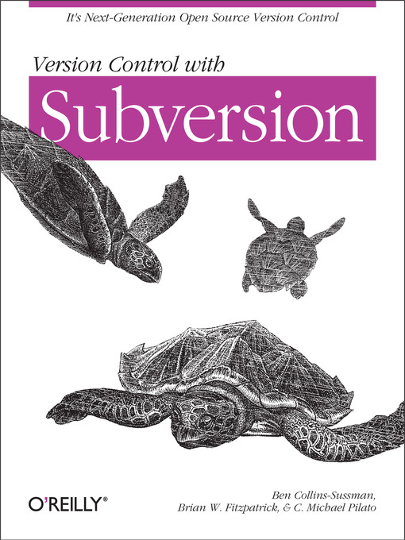

# Управление версиями в Subversion

## Для Subversion 1.4

### (Соответствует редакции 6034)

Бен Коллинз-Сассман
Брайан У. Фитцпатрик
К. Майкл Пилато

Авторские права © 2002, 2003, 2004, 2005, 2006, 2007 Ben Collins-Sussman,
Brian W. Fitzpatrick, C. Michael Pilato

Этот труд выпущен на условиях Creative Commons Attribution License. С текстом
данной лицензии можно ознакомиться в интернете по адресу
[http://creativecommons.org/licenses/by/2.0/](http://creativecommons.org/licenses/by/2.0/), или получить его по почте, отправив
заявку по адресу Creative Commons, 559 Nathan Abbott Way, Stanford,
California 94305, USA.

[Дата выхода в свет будет объявлена дополнительно]
